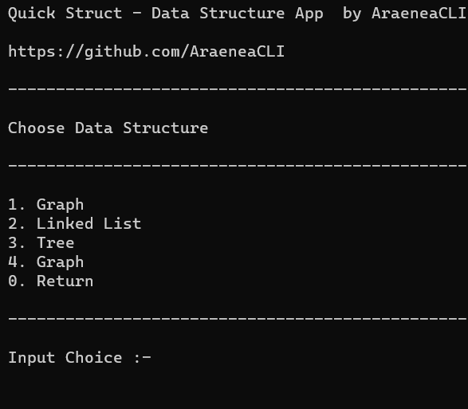

# QuickStruct

[](https://github.com/AraeneaCLI/QuickStruct/actions/workflows/cmake-multi-platform.yml)

## Code by AraeneaCLI



QuicStruct is an Open Source Data Structure Command Line Interface Application.
It Aims for Easier Implementation of Data Structures and Study them.
Suitable for Beginners, Who are New to DataStructures.

## Includes
<ol>
  <li>Header Files</li>
  <li>.exe Application</li>
</ol>

## Run Locally

 Clone the project

```bash

git  clone  https://github.com/AraeneaCLI/QuickStruct.git

```

Go to the project directory

``` bash

cd  QuickStruct

```

## Walkthrough

### File Structure

Header Files

```bash

./src/

```

Mentioning Header Files

```bash

./QuickStruct.h

```

## Socials

[](https://www.linkedin.com/in/yash-mankar-23b453269)

[](https://instagram.com/yash0.flac?igshid=YTQwZjQ0NmI0OA==)
